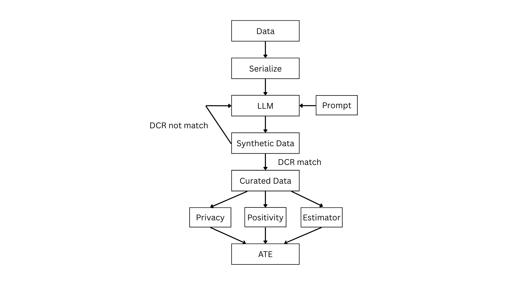

# Intro -- Causal Inference Powered by Hybrid LLM Synthetic Data Generation



This project introduces a hybrid synthetic data generation approach designed to preserve causal structure, particularly the average treatment effect (ATE), when sharing data for causal inference. We show that standard generative models like GANs and LLMs—while strong in predictive metrics—fail to retain key causal quantities. Our hybrid method combines synthetic covariates with simulated treatments and outcomes from fitted models to maintain causal integrity. We also propose using synthetic data to address positivity violations and to benchmark causal estimators in real-world settings where ground truth is unknown. Results demonstrate that hybrid methods yield more reliable ATE estimates than fully synthetic approaches.


# Simulation study

One can generate synthetic data for simulation study. The theoretical ATE here is **0.418256**. You can run the following to quickly obtain the final results

```bash
python iptw.py
python aipw.py
python simulate_gen.py
```

## Simulation Data Generation

Use `data_generate.py` to generate `data.csv`, `data_seed`, and `data_test`.

`data.csv` suffers from positivity issue, while `data_seed` and `data_test` are IID RCT.


## Sythetic Data

We use CTGAN and GReaT to generate synthetic data based on `data_seed`. Place them under `./gan_data` and `./llm_data.csv` as `syn_full.csv`. 


## Hybrid Generation

Run `syn_hybrid.py` to generate A|W and Y|A, W by random forest. The `syn_hybrid.csv` will be seen under ./gan_data and ./llm_data. 


## Positivity
Use `pair.py` to match the sample in `data.csv` and `syn_hybrid.csv` and obtain `pair.csv` that is the final dataset we do inference. Use `iptw.py` and `aipw.py` to see synthetic data helps.


## Other metrics
Use `dcr.py`, `tstr.py` to see the synthetic data quality.


## Synthetic helps with simulaation
Use `simulate_gen.py` to see synthetic data helps to benchmark different estimator.